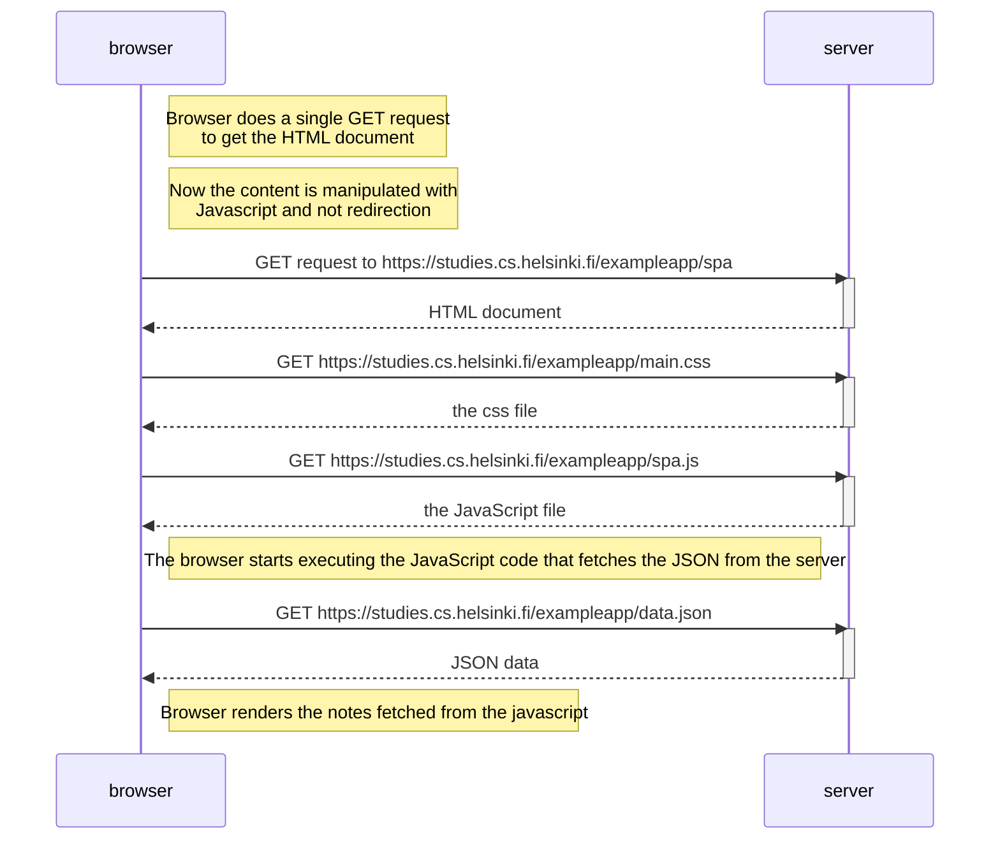

```mermaid
    sequenceDiagram
        participant browser
        participant server

        Note right of browser: Browser does a single GET request <br> to get the HTML document

        Note right of browser: Now the content is manipulated with <br> Javascript and not redirection

        browser->>server: GET request to https://studies.cs.helsinki.fi/exampleapp/spa
        activate server
        server-->>browser: HTML document
        deactivate server

        browser->>server: GET https://studies.cs.helsinki.fi/exampleapp/main.css
        activate server
        server-->>browser: the css file
        deactivate server

        browser->>server: GET https://studies.cs.helsinki.fi/exampleapp/spa.js
        activate server
        server-->>browser: the JavaScript file
        deactivate server

        Note right of browser: The browser starts executing the JavaScript code that fetches the JSON from the server

        browser->>server: GET https://studies.cs.helsinki.fi/exampleapp/data.json
        activate server
        server-->>browser: JSON data
        deactivate server

        Note right of browser: Browser renders the notes fetched from the javascript
```
