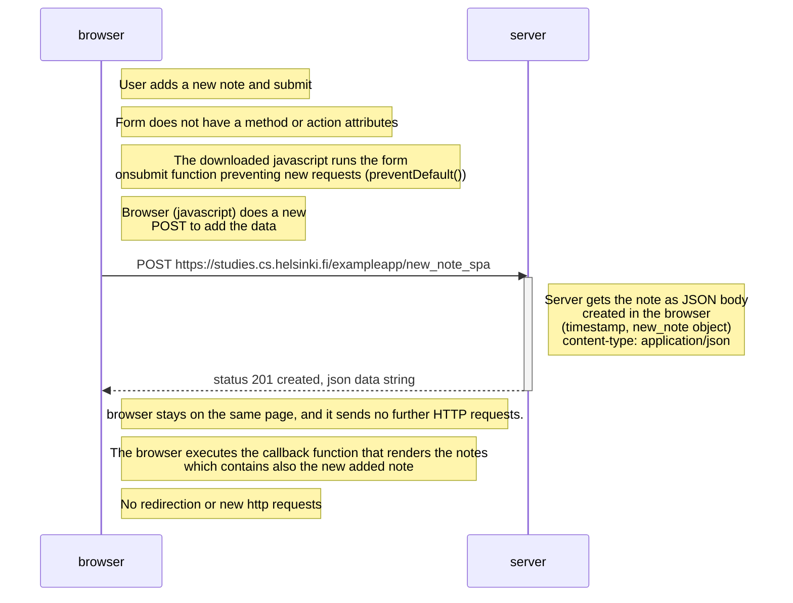

```mermaid
    sequenceDiagram
        participant browser
        participant server
            Note right of browser: User adds a new note and submit
            Note right of browser: Form does not have a method or action attributes
            Note right of browser: The downloaded javascript runs the form <br>onsubmit function preventing new requests (preventDefault())
            Note right of browser: Browser (javascript) does a new<br> POST to add  the data

            browser->>server: POST https://studies.cs.helsinki.fi/exampleapp/new_note_spa
            activate server
            Note right of server: Server gets the note as JSON body<br>created in the browser<br>(timestamp, new_note object)<br>content-type: application/json

            server-->>browser: status 201 created, json data string
            deactivate server

            Note right of browser:  browser stays on the same page, and it sends no further HTTP requests.
            Note right of browser: The browser executes the callback function that renders the notes <br> which contains also the new added note
            Note right of browser: No redirection or new http requests
```
